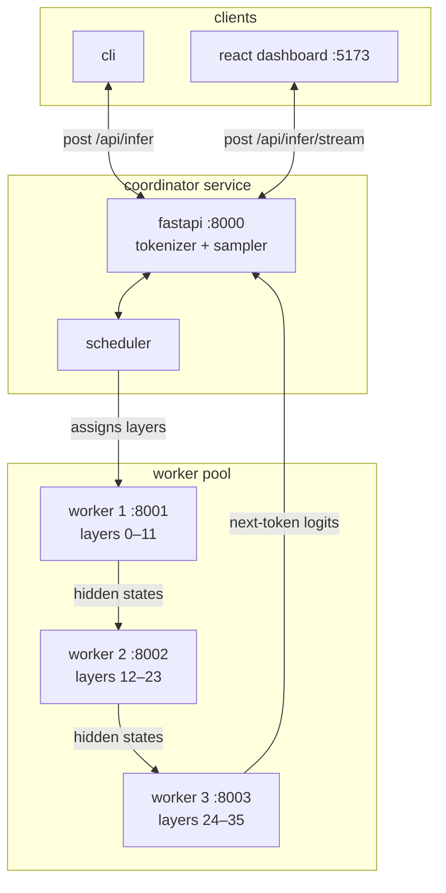
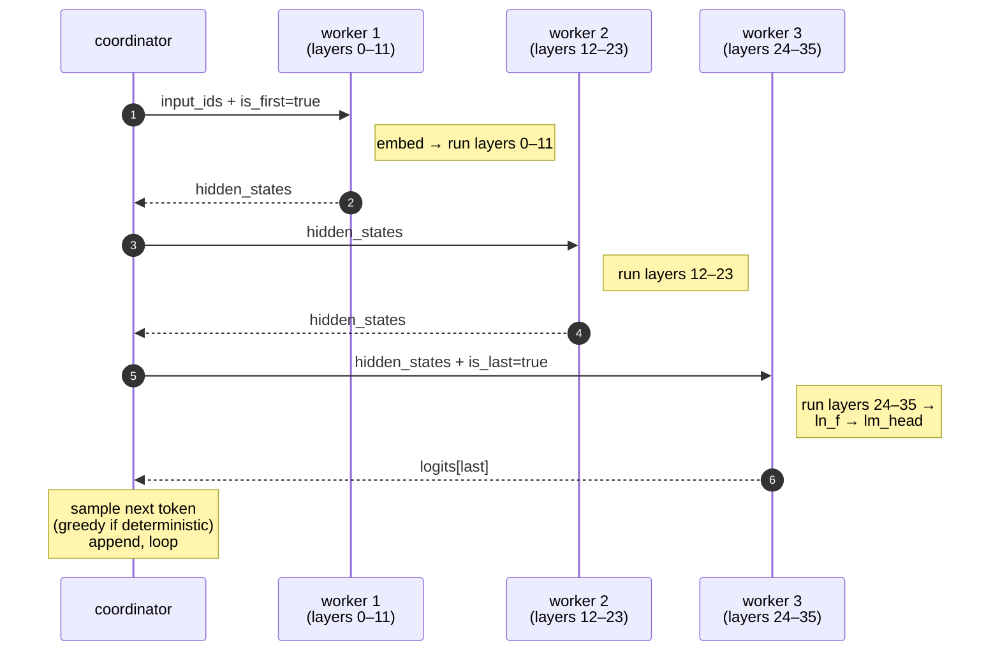
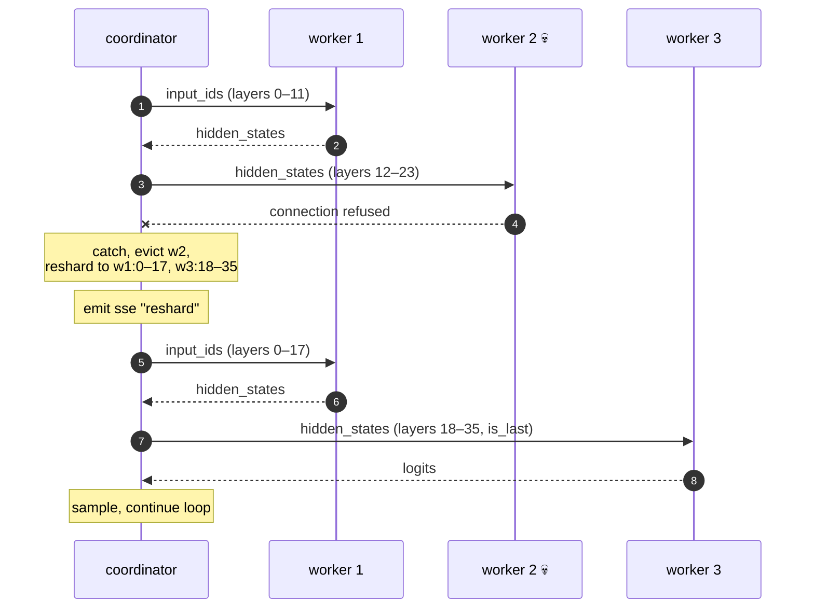

# hivemind

distributed llm inference. split a transformer across a pool of worker nodes, run each generated token through the full pipeline, get output that's bitwise identical to monolithic greedy decoding.

defaults to `gpt2-large` (774m params, 36 layers); needs ~12gb of docker memory for three workers, or swap to a smaller variant with `MODEL_NAME=gpt2-medium`.

```bash
docker compose up --build
python cli/main.py infer -p "the quick brown fox" -d
```

## what it does

- splits the model's transformer layers across a pool of workers as contiguous chunks
- coordinator runs the autoregressive loop; each output token does a full pipeline pass
- `--deterministic` mode uses greedy decoding so output is reproducible
- ci asserts distributed output equals monolithic — if the math breaks, the build goes red
- if a worker dies mid-request, the coordinator reshards layers across survivors and retries
- sse streaming endpoint emits each token with the worker that decoded it
- dashboard renders tokens live, color-coded by worker
- prometheus `/metrics` for throughput, per-worker latency, layer counts

## system overview



## how one token is generated

the coordinator owns the loop. each output token costs one full pass through the chain: embed on the first worker, transit middle workers, finalize on the last worker, sample, append, repeat.



## how layers are sharded

the uniform strategy gives every worker a contiguous chunk of the model's transformer blocks. with 36 layers and 3 workers, that's `w1:0–11`, `w2:12–23`, `w3:24–35`. remainder layers (when the count doesn't divide evenly) go to the earliest workers. interleaved assignment is forbidden — block n+1 depends on block n, so non-contiguous chunks would break the forward pass. the capacity strategy weights chunk size by `cpu_cores + memory_mb/1024`; chunks are still contiguous.

## what happens when a worker dies

the coordinator catches the failed call, evicts the worker from the scheduler, recomputes contiguous chunks across the survivors, and restarts the current pipeline pass with the new topology. the stream emits a `reshard` event so the dashboard can show the moment it happened.



## verifying correctness

```bash
pytest tests/test_scheduler.py    # layer math
pytest tests/test_parity.py       # sharded vs monolithic greedy (no http)
pytest tests/test_e2e.py          # against a running cluster
```

ci runs all three on every push to `main`.

## demo: failure recovery

```bash
# terminal 1
docker compose up

# terminal 2 — start a long stream
curl -N -X POST localhost:8000/api/infer/stream \
  -H 'content-type: application/json' \
  -d '{"prompt": "once upon a time", "max_tokens": 80}'

# terminal 3 — kill a worker mid-stream
curl -X DELETE localhost:8000/api/workers/worker-2
```

the stream continues. a `reshard` event marks the topology change.

## api

| method | endpoint | notes |
|---|---|---|
| `POST` | `/api/infer` | blocking; returns full result + worker trace |
| `POST` | `/api/infer/stream` | sse; events: start, token, reshard, done, error |
| `GET` | `/api/workers` | workers + scheduler stats |
| `POST` | `/api/workers/register` | worker registration; response carries layer assignment |
| `POST` | `/api/workers/heartbeat` | worker heartbeat |
| `DELETE` | `/api/workers/{id}` | evict a worker (for demoing failure recovery) |
| `GET` | `/api/jobs` | recent job history with reshard events |
| `GET` | `/api/health` | liveness |
| `GET` | `/metrics` | prometheus exposition format |

## tech stack

| layer | tech |
|---|---|
| coordinator | fastapi, httpx, pytorch (tokenizer + sampler) |
| worker | fastapi, pytorch, transformers (gpt-2) |
| cli | click, rich |
| dashboard | react 18, typescript, vite, tailwind |
| orchestration | docker compose |
| model | gpt2-large (774m, 36 layers) by default; swap via `MODEL_NAME` |
