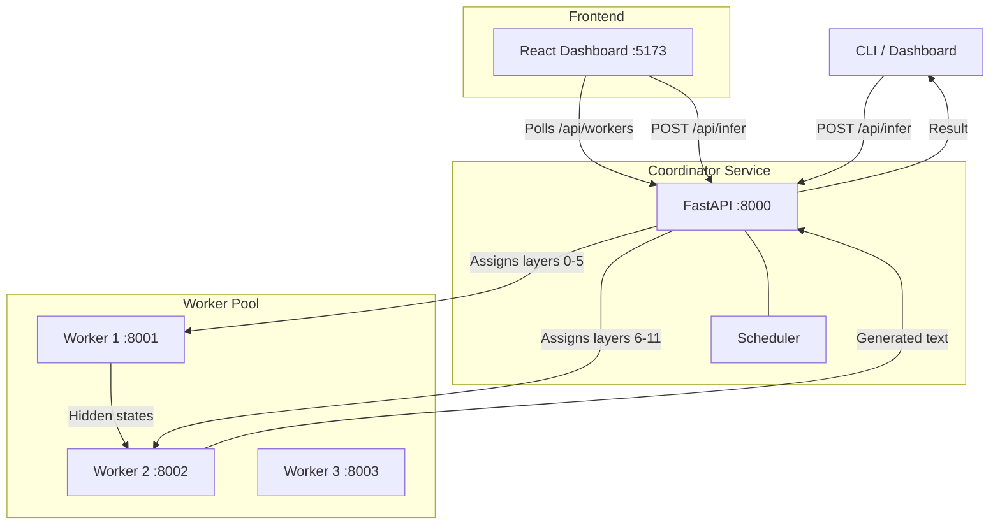

# Hivemind

Distributed AI inference across multiple worker nodes. Split large language models across machines that can't individually hold the full model in memory.

## What It Does

Hivemind coordinates GPT-2 inference across a pool of worker nodes. The coordinator receives prompts, splits model execution across available workers by assigning transformer layers, and collects results. Each worker only loads and processes its assigned layers, enabling inference on models too large for a single machine.

## Why

Running modern LLMs requires significant compute and memory. A single consumer GPU often can't hold an entire model. Hivemind demonstrates **pipeline parallelism** -- splitting model layers across machines so each node handles a fraction of the computation. This is the same principle used by systems like Petals and DeepSpeed, scaled down to something you can run on a few machines or containers.

## Architecture



## How Inference Splitting Works

1. **Registration**: Workers start up and register with the coordinator, reporting their CPU cores and available memory.

2. **Layer Assignment**: The scheduler divides GPT-2's 12 transformer layers across healthy workers. With 2 workers: Worker 1 gets layers 0-5, Worker 2 gets layers 6-11. The strategy can be round-robin or capacity-based (more powerful machines get more layers).

3. **Pipeline Execution**:
   - Worker 1 (encode phase): Tokenizes the prompt, computes embeddings, runs through layers 0-5, sends hidden states to the coordinator.
   - Worker 2 (decode phase): Receives hidden states, runs through layers 6-11, applies layer norm, projects to vocabulary, decodes tokens.

4. **Result**: The coordinator collects the generated text and returns it with a full trace showing which worker handled which layers and how long each step took.

## vs electron-p2p

| | Hivemind | electron-p2p |
|---|---|---|
| **Sandboxing** | Workers run in Docker containers with no host access | Zero sandboxing -- remote peers get full OS access |
| **Code execution** | Only runs pre-loaded ML model layers | Executes arbitrary code from remote peers |
| **Auth** | Worker registration with coordinator | None |
| **Network** | HTTP APIs between containers | Raw libp2p with no access controls |
| **What runs** | Specific tensor operations on assigned layers | Anything the remote peer sends |
| **Model** | Pipeline parallelism for ML inference | General-purpose remote code execution |

electron-p2p lets any peer on the network execute arbitrary code on your machine with full filesystem, network, and process access. There is no sandboxing, no authentication, and no restriction on what code can do. Hivemind workers only execute pre-loaded model layers inside containers -- they never run arbitrary code.

## Tech Stack

| Component | Technology |
|---|---|
| Coordinator | Python, FastAPI, httpx |
| Worker | Python, FastAPI, PyTorch, Transformers (GPT-2) |
| CLI | Python, Click, Rich |
| Dashboard | React 18, TypeScript, Vite, Tailwind CSS |
| Containers | Docker, Docker Compose |
| Model | GPT-2 (124M params, 12 transformer layers) |

## Quick Start

### Docker Compose (recommended)

```bash
docker compose up --build
```

This starts the coordinator on :8000, three workers, and the dashboard on :5173.

### Manual

Start the coordinator:

```bash
cd coordinator
pip install -r requirements.txt
python main.py
```

Start workers (in separate terminals):

```bash
cd worker
pip install -r requirements.txt
WORKER_ID=worker-1 WORKER_PORT=8001 python main.py
WORKER_ID=worker-2 WORKER_PORT=8002 python main.py
```

Run the CLI:

```bash
cd cli
pip install -r requirements.txt
python main.py infer --prompt "Once upon a time" --max-tokens 50
python main.py workers
python main.py benchmark --prompts 5
```

Open the dashboard:

```bash
cd dashboard
npm install
npm run dev
```

## API

| Method | Endpoint | Description |
|---|---|---|
| `POST` | `/api/infer` | Submit prompt for distributed inference |
| `GET` | `/api/workers` | List workers and throughput stats |
| `POST` | `/api/workers/register` | Register a new worker |
| `POST` | `/api/workers/heartbeat` | Worker heartbeat |
| `GET` | `/api/jobs` | Recent job history |
| `GET` | `/api/health` | Coordinator health check |

## License

MIT
