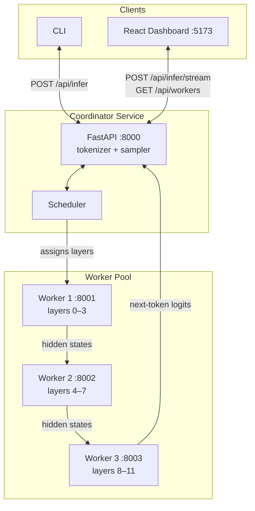

# Hivemind

Distributed LLM inference across a pool of worker nodes. Splits GPT-2's transformer layers across machines, runs each generated token through the full pipeline, and produces output that's **provably identical** to monolithic greedy decoding.

```bash
docker compose up --build
python cli/main.py infer -p "The quick brown fox" -d   # deterministic mode
```

## What it actually does

- **Pipeline parallelism, for real.** Each worker holds a contiguous range of transformer layers. Hidden states flow worker → worker between layers. The coordinator runs an autoregressive loop, pulling one token per pipeline pass.
- **Provable correctness.** A `--deterministic` flag uses greedy decoding. CI runs a parity test that asserts the distributed output equals a locally-computed monolithic run. If the math is wrong, the build is red.
- **Live failure recovery.** Kill a worker mid-request and the coordinator catches the failure, re-shards layers across surviving workers, and retries. The dashboard shows reshard events as they happen.
- **Token-level streaming.** SSE endpoint emits each token as it's generated, with the worker that decoded it. The dashboard renders tokens color-coded by worker as they arrive.
- **Optional weight shedding.** Workers can drop layers they aren't assigned (`SHED_WEIGHTS=true`) to demonstrate real memory savings. Off by default so failure recovery can re-distribute work.

## Architecture



## How a request flows

1. Coordinator tokenizes the prompt once.
2. For each output token (loop):
   - Worker 0 embeds the current token sequence and runs its layers → emits hidden states.
   - Middle workers receive hidden states, run their layers, pass on.
   - Final worker runs its layers, applies `ln_f` and `lm_head`, returns logits for the last position.
   - Coordinator samples the next token (greedy if `deterministic=true`, top-p otherwise).
   - If EOS, stop. Otherwise append and loop.
3. If a worker call fails: drop it from the scheduler, re-shard contiguous layer ranges across the survivors, retry the current token. Recorded in `reshard_events` on the response.

The autoregressive loop deliberately lives in the coordinator, not in the last worker. That's what makes the layer split real — every output token is a full pipeline pass.

## Scheduler

Two strategies, both produce **contiguous** layer ranges (interleaved ranges break the forward pass because block N+1 depends on block N's output):

- `UNIFORM`: equal-sized contiguous chunks. Remainder layers distribute to earliest workers. 12 layers / 5 workers → `[3,3,2,2,2]`.
- `CAPACITY`: chunk size weighted by each worker's `cpu_cores + memory_mb/1024` score; still contiguous.

## Verifying correctness

```bash
pytest tests/test_scheduler.py    # layer math
pytest tests/test_parity.py       # sharded vs monolithic greedy, no HTTP
pytest tests/test_e2e.py          # against a running cluster (requires docker compose up)
```

The CI workflow runs all three on every push to `main`.

## Demo: failure recovery

```bash
# in one terminal
docker compose up

# in another
curl -X POST localhost:8000/api/infer/stream \
  -H 'Content-Type: application/json' \
  -d '{"prompt": "Once upon a time", "max_tokens": 80}'

# in a third, kill a worker mid-stream
curl -X DELETE localhost:8000/api/workers/worker-2
```

The stream continues without dropping tokens; a `reshard` event marks the point where the topology changed.

## API

| Method | Endpoint | Notes |
|---|---|---|
| `POST` | `/api/infer` | Blocking; returns full result + worker trace |
| `POST` | `/api/infer/stream` | SSE; events: `start`, `token`, `reshard`, `done`, `error` |
| `GET` | `/api/workers` | Workers + scheduler stats |
| `POST` | `/api/workers/register` | Worker registration; response carries layer assignment |
| `POST` | `/api/workers/heartbeat` | Worker heartbeat |
| `DELETE` | `/api/workers/{id}` | Evict a worker (for demoing failure recovery) |
| `GET` | `/api/jobs` | Recent job history with reshard events |
| `GET` | `/api/health` | Liveness |
| `GET` | `/metrics` | Prometheus exposition format |

## Tech stack

| | |
|---|---|
| Coordinator | FastAPI, httpx, PyTorch (tokenizer + sampler) |
| Worker | FastAPI, PyTorch, Transformers (GPT-2) |
| CLI | Click, Rich |
| Dashboard | React 18, TypeScript, Vite, Tailwind |
| Orchestration | Docker Compose |
| Model | GPT-2 (124M, 12 layers); swap via `MODEL_NAME` |

## What's deliberately not here yet

- **Continuous batching.** Today, concurrent requests serialize through the pipeline. Real batching (request queueing, KV cache pooling, batch formation) is the natural next step.
- **KV cache.** Each token recomputes the whole prefix. Adding a KV cache that propagates with hidden states is a major perf win but a significant complexity bump.
- **Larger models.** GPT-2 fits comfortably on one machine; the sharding here is a correctness demo, not a memory necessity. Swapping to `gpt2-xl` or Phi-3-mini is mostly an env var + tokenizer change.
- **GPU workers.** All inference runs on CPU. Heterogeneous workers (some GPU, some CPU) with capacity-weighted assignment is the obvious extension.

## License

MIT
